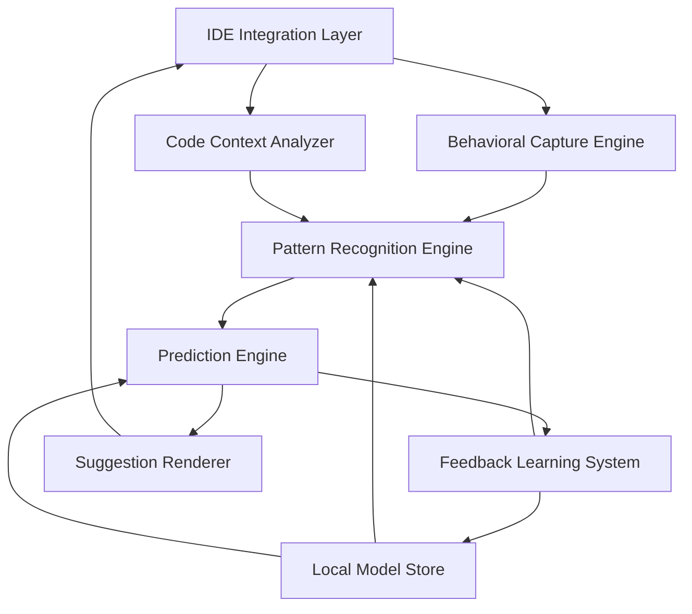

# Design Document

## Overview

The Predictive Development Assistant is built as a multi-layered AI system that combines behavioral analysis, code understanding, and predictive modeling to anticipate developer actions. The architecture follows a real-time processing pipeline that captures developer behavior, analyzes code context, and generates predictions using machine learning models trained on individual coding patterns.

The system operates entirely locally to ensure privacy and low latency, using a combination of transformer-based language models for code understanding and recurrent neural networks for behavioral sequence modeling. The design emphasizes incremental learning, allowing the system to continuously adapt to changing developer patterns without requiring full model retraining.

## Architecture

### High-Level Architecture



### Core Components

1. **IDE Integration Layer**: Plugin architecture for popular IDEs (VS Code, IntelliJ, etc.)
2. **Behavioral Capture Engine**: Real-time tracking of developer actions and patterns
3. **Code Context Analyzer**: AST parsing and semantic understanding of current code state
4. **Pattern Recognition Engine**: ML models for identifying behavioral and coding patterns
5. **Prediction Engine**: Transformer-based system for generating code predictions
6. **Feedback Learning System**: Online learning mechanism for model improvement
7. **Local Model Store**: Encrypted storage for personal behavioral models

## Components and Interfaces

### Behavioral Capture Engine

**Purpose**: Captures and processes developer behavioral data in real-time

**Key Features**:

- Keystroke timing analysis with privacy-preserving hashing
- Mouse movement and click pattern tracking
- Code editing sequence recording (structural changes only)
- Context switching and focus pattern analysis
- Fatigue detection through typing rhythm changes

**Interface**:

```typescript
interface BehavioralCaptureEngine {
  startCapture(): void;
  stopCapture(): void;
  getBehavioralMetrics(): BehavioralMetrics;
  onPatternDetected(callback: (pattern: BehavioralPattern) => void): void;
}

interface BehavioralMetrics {
  typingSpeed: number;
  pausePatterns: number[];
  decisionTime: number;
  contextSwitches: number;
  fatigueLevel: number;
}
```

### Code Context Analyzer

**Purpose**: Understands current code structure and semantic context

**Key Features**:

- Multi-language AST parsing (TypeScript, Python, Java, etc.)
- Symbol table construction and scope analysis
- Dependency graph generation
- Code quality metrics calculation
- Architectural pattern detection

**Interface**:

```typescript
interface CodeContextAnalyzer {
  analyzeFile(filePath: string): CodeContext;
  analyzeProject(projectPath: string): ProjectContext;
  getSymbolTable(): SymbolTable;
  getDependencyGraph(): DependencyGraph;
}

interface CodeContext {
  ast: AbstractSyntaxTree;
  symbols: SymbolTable;
  scope: ScopeInfo;
  patterns: ArchitecturalPattern[];
  quality: QualityMetrics;
}
```

### Pattern Recognition Engine

**Purpose**: Identifies patterns in behavioral and coding data using ML models

**Key Features**:

- Sequence-to-sequence modeling for behavioral patterns
- Clustering algorithms for coding style identification
- Anomaly detection for pattern changes
- Temporal pattern analysis with sliding windows
- Cross-project pattern transfer learning

**Architecture**:

- **Behavioral Model**: LSTM-based sequence model for action prediction
- **Style Model**: Transformer encoder for coding style embedding
- **Context Model**: Graph neural network for project structure understanding
- **Adaptation Model**: Meta-learning system for quick adaptation to new patterns

**Interface**:

```typescript
interface PatternRecognitionEngine {
  trainBehavioralModel(data: BehavioralSequence[]): void;
  predictNextActions(context: CombinedContext): ActionPrediction[];
  updateModel(feedback: PredictionFeedback): void;
  detectPatternChange(): boolean;
}
```

### Prediction Engine

**Purpose**: Generates code predictions based on recognized patterns and context

**Key Features**:

- Multi-modal prediction combining behavioral and code context
- Confidence scoring for prediction ranking
- Template-based generation for common patterns
- Custom code generation for unique developer styles
- Real-time prediction refinement

**Model Architecture**:

- **Base Model**: CodeT5-based transformer fine-tuned on code completion
- **Behavioral Adapter**: Lightweight neural network that modifies base predictions
- **Context Encoder**: Separate encoder for project and file context
- **Fusion Layer**: Attention mechanism combining all input modalities

**Interface**:

```typescript
interface PredictionEngine {
  generatePredictions(context: PredictionContext): CodePrediction[];
  rankPredictions(predictions: CodePrediction[]): RankedPrediction[];
  refineWithFeedback(prediction: CodePrediction, feedback: UserFeedback): void;
}

interface CodePrediction {
  code: string;
  confidence: number;
  reasoning: string;
  type: PredictionType;
}
```

## Data Models

### Behavioral Pattern Model

```typescript
interface BehavioralPattern {
  id: string;
  userId: string;
  timestamp: Date;
  sequence: BehavioralAction[];
  context: ContextSnapshot;
  frequency: number;
  confidence: number;
}

interface BehavioralAction {
  type: ActionType;
  timestamp: number;
  duration: number;
  metadata: Record<string, any>;
}
```

### Code Context Model

```typescript
interface ProjectContext {
  projectId: string;
  language: string;
  framework: string;
  architecture: ArchitecturalPattern;
  dependencies: Dependency[];
  codeStyle: StyleProfile;
  qualityMetrics: QualityMetrics;
}

interface StyleProfile {
  indentation: IndentationStyle;
  naming: NamingConvention;
  structure: StructuralPreferences;
  patterns: PreferredPatterns[];
}
```

### Prediction Model

```typescript
interface PredictionContext {
  currentCode: string;
  cursorPosition: number;
  fileContext: CodeContext;
  projectContext: ProjectContext;
  behavioralState: BehavioralMetrics;
  recentActions: BehavioralAction[];
}

interface RankedPrediction {
  prediction: CodePrediction;
  rank: number;
  combinedScore: number;
  behavioralScore: number;
  contextScore: number;
}
```

## Error Handling

### Graceful Degradation Strategy

1. **Model Unavailable**: Fall back to simpler heuristic-based predictions
2. **Context Analysis Failure**: Use cached context or simplified analysis
3. **Behavioral Data Corruption**: Reset behavioral model and restart learning
4. **Performance Degradation**: Reduce model complexity or disable features
5. **Privacy Violations**: Immediately halt data collection and purge sensitive data

### Error Recovery Mechanisms

```typescript
interface ErrorHandler {
  handleModelError(error: ModelError): RecoveryAction;
  handleDataCorruption(corruption: DataCorruption): void;
  handlePerformanceIssue(metrics: PerformanceMetrics): void;
  handlePrivacyViolation(violation: PrivacyViolation): void;
}

enum RecoveryAction {
  FALLBACK_TO_SIMPLE_MODEL,
  RESTART_COMPONENT,
  DISABLE_FEATURE,
  FULL_SYSTEM_RESET,
}
```

## Testing Strategy

### Unit Testing

- **Behavioral Analysis**: Mock behavioral data with known patterns
- **Code Context**: Test AST parsing with various code samples
- **Pattern Recognition**: Validate model predictions with synthetic datasets
- **Prediction Engine**: Test code generation with curated examples

### Integration Testing

- **End-to-End Workflow**: Complete prediction cycle from input to suggestion
- **IDE Integration**: Test plugin functionality across different IDEs
- **Model Pipeline**: Validate data flow between all components
- **Performance Testing**: Measure latency and resource usage under load

### Machine Learning Testing

- **Model Validation**: Cross-validation with held-out developer data
- **Behavioral Model Testing**: Sequence prediction accuracy metrics
- **Code Generation Testing**: BLEU scores and semantic similarity
- **Adaptation Testing**: Measure learning speed with new patterns

### Privacy Testing

- **Data Leakage Detection**: Ensure no raw code in stored models
- **Differential Privacy Validation**: Verify privacy guarantees
- **Isolation Testing**: Confirm project data separation
- **Deletion Verification**: Test complete data removal functionality

### Performance Benchmarks

- **Prediction Latency**: < 200ms for real-time suggestions
- **Memory Usage**: < 500MB for local model storage
- **CPU Usage**: < 10% during active prediction
- **Model Training Time**: < 30 seconds for incremental updates
